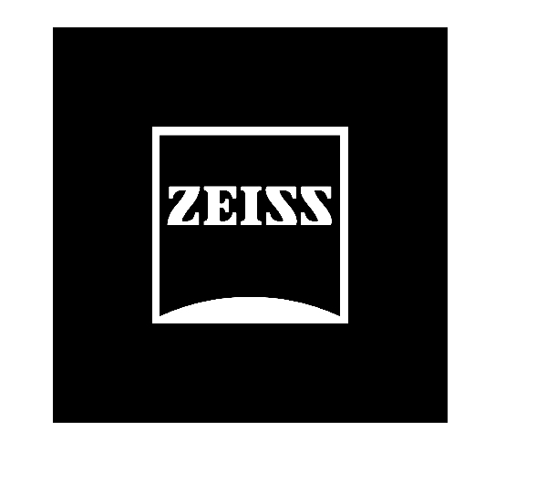
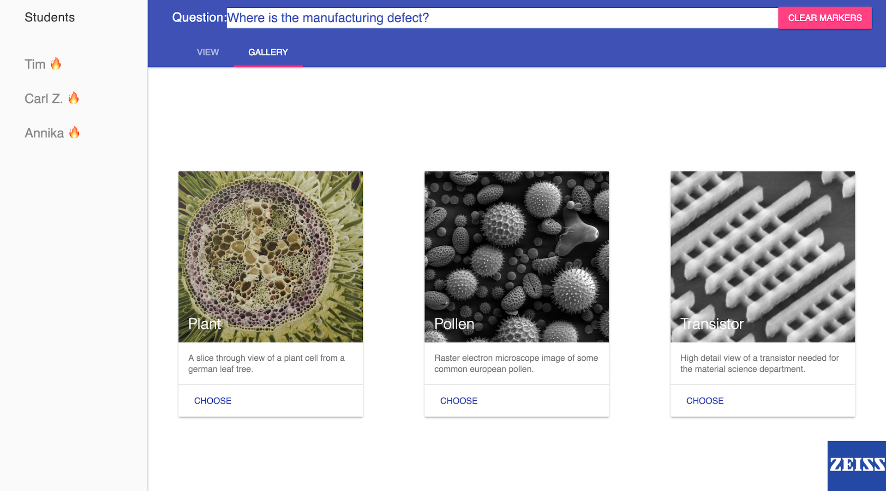
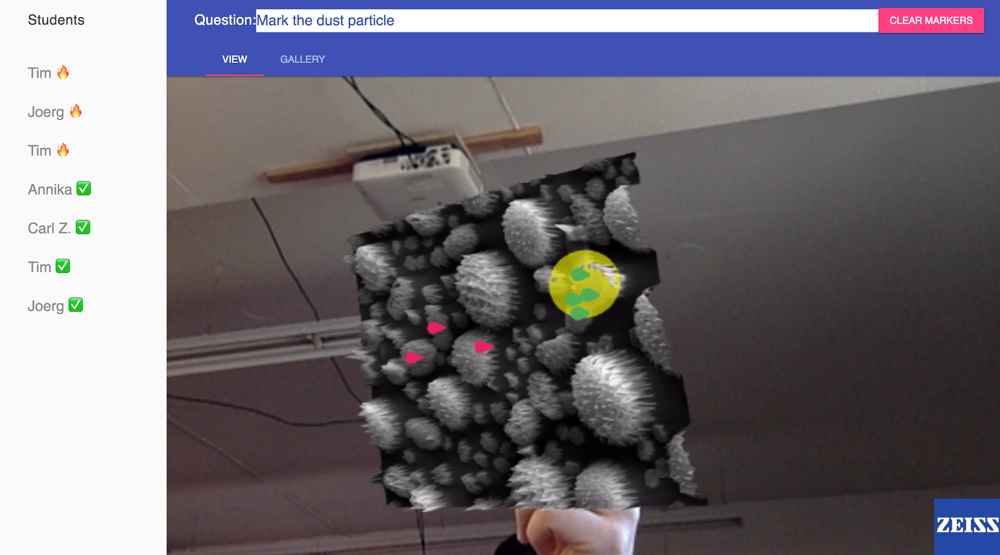

# microlabborators 👩‍👦‍👦🔬👩‍🏫

> put microscope images into AR for advanced collaboration 🔮🔬👩‍🏫

Teacher/student classroom scenario for gamified collaboration on three dimensional microscopic images.
By opening the website on a device with a camera ([iOS not supported](https://webkit.org/status/#specification-webrtc) 😓) pupils and the teacher can interact visually, from remote locations and in realtime.


The idea is that the teacher can ask a question regarding the current image and the students can answer it by placing markers/annotations on the image. The teacher can see all annotations and validate the students response.

> Note: This codebase was created as part of the Zeiss Hackathon 2017-04-29 in Munich. Don't blame us for the ugly code!

## ✏️ authors

* Tim Großmann
  * [Github](http://github.com/timgrossmann)
  * [Twitter](https://twitter.com/timigrossmann)
* Andreas Offenhaeuser
  * [Website](http://anoff.io)
  * [Twitter](https://twitter.com/an0xff)

## 👾🦄 usage

To use the augmented reality feature you need to get your hands on a markerimage of the [zeiss marker](./public/markers/zeiss.jpg). Just print it out or open it on your laptop. After you got a marker just head over to the website, see below.
Currently there are two separate views implemented for student and teachers. In a production environment there would be authentication & authorization concepts in place that automatically route the user to the correct view.

### 👨‍🎓 student

[https://zeisshackathon.surge.sh](https://zeisshackathon.surge.sh)



### 👩‍🏫 teacher

[https://zeisshackathon.surge.sh/teacher](https://zeisshackathon.surge.sh/teacher)

### running the server

You can start a local development server with server-side autorestart and access it at [https://localhost:8083](https://localhost:8083)

```sh
yarn
npm start
```

### deploying the website

If you are Tim or Andreas you can deploy the code to surge at [zeisshackathon.surge.sh](https://zeisshackathon.surge.sh)

```sh
npm run deploy
```

If you're someone else just put the `public` folder on any static hosting.
All the dynamic features are **client only** and realized over [firebase](http://firebase.com).

## 📽 demo / workflow

This section describes how the solution would be used in a real environment.

### preparation

Teaching environment e.g. school with a teacher using a microscope that allows digital image capturing. Students use a smartphone with camera and internet/wifi.

The students open the [student website](https://zeisshackathon.surge.sh) and place the [AR marker](./public/markers/zeiss.jpg) as paper on their desk (might be handed out by teacher).


### providing the question

The teacher goes to the teacher website and uploads/selects and image from his microscope he wants to discuss. He inputs the question in the top of the website and it gets broadcasted to all students.



### gamification

The students see the new image and an updated question. Each student can place a marker, if he misplaces it he can replace it by clicking the screen again.
By moving their phone around they can look at the image from different angles with a 3d effect.


### evaluation of responses

While the students place their markers the teacher gets all answers in real time in his view and can select the correct region he expects to be placed. An overview shows him how many students answered correctly. This allows him to get feedback from the whole class without them influencing each other.



## ⚖️ License

[MIT](./LICENSE)

## 🗂 Used puzzle pieces / Attribution

* [AR.js](https://github.com/jeromeetienne/AR.js): helped us a lot to get off the ground
* [firebase](firebase.google.com): allowed us to do realtime collaboration without backend
* [three.js](https://github.com/jeromeetienne/AR.js/tree/master/three.js): used for 3D markers
* [material design lite](https://getmdl.io/components/index.html): fancy design
* [Zeiss](https://www.zeiss.com): thanks for hosting and guiding us during the hackathon
