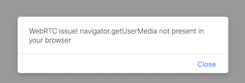

# AR stuff for microscope

> put microscope images into AR for advanced collaboration 🔮🔬

Teacher/student classroom scenario for gamified collaboration on three dimensional microscopic images.
By opening the website on a device with a camera ([iOS not supported](https://webkit.org/status/#specification-webrtc) 😓) pupils and the teacher can interact visually, from remote locations and in realtime.



The idea is that the teacher can ask a question regarding the current image and the students can answer it by placing markers/annotations on the image. The teacher can see all annotations and validate the students response.

> Note: This codebase was created as part of the Zeiss Hackathon 2017-04-29 in Munich. Don't blame us for the ugly code!

## usage

To use the augmented reality feature you need to get your hands on a markerimage of the [hiro marker](./hiro.jpg). Just print it out or open it on your laptop. After you got a marker just head over to the website, see below.
Currently there are two separate views implemented for student and teachers. In a production environment there would be authentication & authorization concepts in place that automatically route the user to the correct view.

### student

[https://zeisshackathon.surge.sh](https://zeisshackathon.surge.sh)

### teacher

[https://zeisshackathon.surge.sh/teacher](https://zeisshackathon.surge.sh/teacher)

### running the server

You can start a local development server with server-side autorestart and access it at [https://localhost:8083](https://localhost:8083)

```sh
yarn
npm start
```

### deploying the website

If you are Tim or Andreas you can deploy the code to surge at [https://zeisshackathon.surge.sh](https://zeisshackathon.surge.sh)

```sh
npm run deploy
```

## License

MIT
